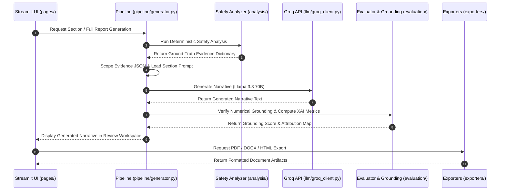
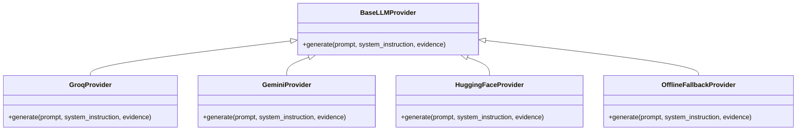

# Architecture Reference — RegIntel AI

Author: **Madhav Kumar**  
System: **Pharmacovigilance Safety Reporting Platform (PADER Engine)**

---

## System Architecture Diagram


---

## 1. Architectural Design Principles

This project follows a clean, modular Python architecture. Streamlit is used exclusively as a presentation frontend, keeping all business logic, data processing, and LLM orchestration decoupled.

```
+-------------------------------------------------------+
|                Streamlit Presentation Layer           |
|                (app.py & pages/ 1..10)                |
+-------------------------------------------------------+
                           |
                           v
+-------------------------------------------------------+
|               Business Logic & Pipeline               |
|                (pipeline/generator.py)                |
+-------------------------------------------------------+
       |                   |                  |
       v                   v                  v
+--------------+    +--------------+   +--------------+
| Analytics    |    | LLM Layer    |   | Exporters    |
| (analysis/)  |    | (llm/)       |   | (exporters/) |
+--------------+    +--------------+   +--------------+
```

---

## 2. End-to-End Data Pipeline Flow



---

## 3. Provider Abstraction Layer



---

## 4. Key Engineering Choices

- **No Framework Dependencies**: Built without LangChain, LangGraph, or AutoGen to avoid unnecessary abstraction layers and performance overhead.
- **Resilient Fallback**: Uses Groq API as the primary engine with a 1.2s delay between sections to stay within TPM limits, falling back automatically to the offline rule synthesizer if rate-limited.
- **Custom Document Rendering**: Markdown pipe tables are parsed into native ReportLab `Table` objects for PDF rendering and `python-docx` elements for Word rendering.
