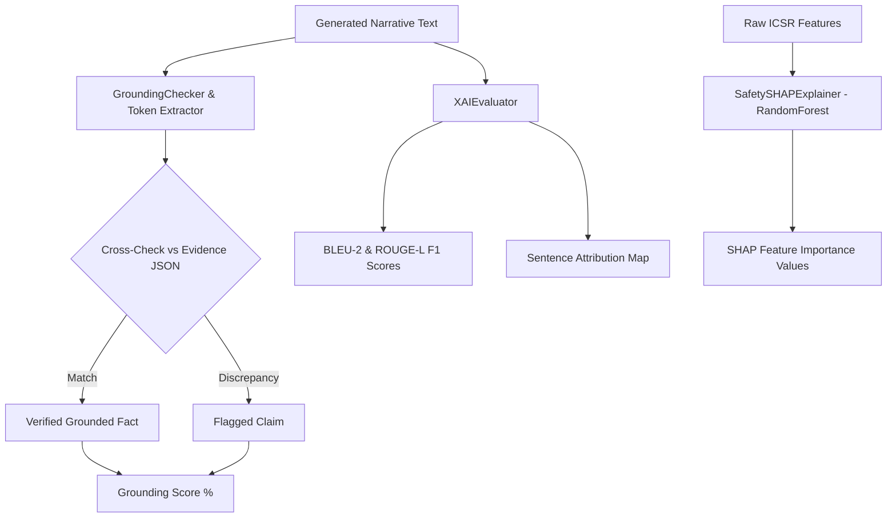

# Evaluation & Verification Framework (EVALUATION.md)

Author: **Madhav Kumar**  
System: **RegIntel AI Safety Reporting Engine**

---

## Overview

In safety-critical regulatory applications, standard NLP metrics (such as BLEU or ROUGE alone) are insufficient because they measure text overlap rather than **factual correctness**.

RegIntel AI evaluates generated reports using a two-part framework:
1. **Deterministic Grounding Verification**: Verifies that 100% of numerical figures in generated prose match calculated Python statistics.
2. **Quantitative NLP & Explainable AI (XAI)**: Evaluates structural similarity, BLEU-2, ROUGE-L F1, and SHAP feature attributions.

---

## Evaluation Architecture

---

## Evaluation Metrics Summary

| Metric | Target | Description |
|---|---|---|
| **Numerical Grounding Score** | 100.0% | Percentage of numerical claims verified against calculated dataset metrics. |
| **BLEU-2 Score** | > 0.10 | Evaluates 2-gram precision against section reference templates. |
| **ROUGE-L F1 Score** | > 0.20 | Evaluates Longest Common Subsequence F1 score against section reference templates. |
| **Hallucination Rate** | 0.0% | Percentage of unverified numerical claims (100% - Precision). |
| **SHAP Feature Importance** | Non-zero values | Ranks patient features (Age, Sex, Country, Reaction) driving hospitalization risk. |

---

## Verification Suite

- **Automated Tests**: Unit test suite (`tests/`) covers analytics, evidence scoping, NLP evaluation metrics, and SHAP feature importance.
- **Audit Logs**: Every pipeline execution logs dataset SHA-256 integrity hashes, prompt versions, model parameters, and verification scores.
