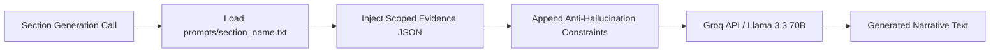

# Prompt Engineering Specification (PROMPTS.md)

Author: **Madhav Kumar**  
System: **RegIntel AI Safety Reporting Engine**

---

## Strategy Overview

In regulatory reporting systems, using a single monolithic prompt introduces context saturation, attention drift, and numerical errors. RegIntel AI uses a **section-scoped prompt decomposition strategy**.

Section system prompts are stored externally in `prompts/` and combine:
1. **Role Definition**: Regulatory affairs specialist / medical writer perspective.
2. **System Constraints**: Explicit prohibition of ungrounded numerical claims.
3. **Scoped Evidence JSON**: Pre-computed metrics isolated for that specific section.
4. **Format Standard**: Formal regulatory text style adhering to US FDA 21 CFR 314.80.

---

## Prompt Pipeline Flow

---

## Section Prompt Definitions

### 1. Section 1: Reporting Period & General Header (`prompts/header.txt`)
Formats NDA product metadata, application number, reporting interval dates, and Marketing Authorization Holder (MAH) details using standard FDA header formatting.

### 2. Section 2: Narrative Summary and Analysis (`prompts/narrative_summary.txt`)
Synthesizes an executive safety summary based on pre-computed total cases, serious counts, 15-day alert totals, demographic distributions, and top MedDRA Preferred Terms.

### 3. Section 3: Summary Analysis of Cases (`prompts/summary_analysis.txt`)
Authors structured text detailing case volume, ICH E2A seriousness criteria breakdown, patient age/sex demographics, and reporter qualifications.

### 4. Section 4: Reaction / Adverse Event Analysis (`prompts/adverse_events.txt`)
Presents clinical analysis of MedDRA Preferred Terms (PTs) and event outcomes. Includes an explicit note that analysis is presented at the PT level because System Organ Class (SOC) fields were not present in the dataset.

### 5. Section 5: Serious Cases / 15-Day Alerts (`prompts/alerts.txt`)
Summarizes 15-Day Expedited Alert reports submitted under 21 CFR 314.80(c)(2)(i), including total counts and representative case line listings.

### 6. Section 6: Trends and Important Observations (`prompts/trends.txt`)
Evaluates time-series monthly case submission trends. Includes the required regulatory disclaimer stating that a statistical trend does not automatically constitute a confirmed safety signal.

### 7. Section 7: History of Safety-Related Actions (`prompts/actions.txt`)
Explicitly states that no safety-related actions (such as labeling changes, black box warnings, or regulatory communications) were taken during the reporting interval.

### 8. Section 8: Case Index / Line Listing Overview (`prompts/case_index.txt`)
Details the structure of the master ICSR line listing indexing all unique safety reports received during the interval.
