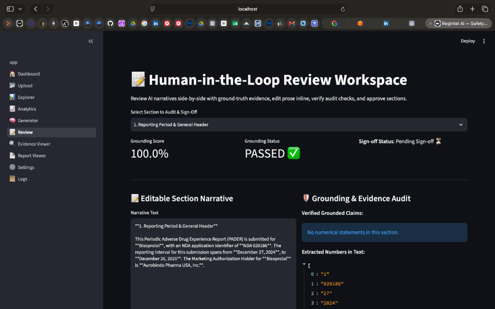

# ⚕️ RegIntel AI — Enterprise Pharmacovigilance Platform

**US FDA 21 CFR 314.80 Regulatory Safety Reporting Engine**

Author: **Madhav Kumar**  
GitHub Repository: [https://github.com/kmadhav07/PADER_Report](https://github.com/kmadhav07/PADER_Report)  
Tech Stack: Python 3.11+, Streamlit, Groq LPU API (Llama 3.3 70B), Pandas, Plotly, SHAP, ReportLab, Docker

---

## 📐 System Architecture



*Figure 1: End-to-End System Architecture — Presentation Layer, Core Pipeline, Multi-Provider LLM Engine, XAI Evaluation Suite, and Document Exporters.*

---

## 📌 Executive Summary & Architecture Philosophy

In post-marketing drug safety, pharmaceutical companies process thousands of Individual Case Safety Reports (ICSRs) annually. Submitting periodic aggregate safety reports (PADERs) to regulatory authorities requires strict numerical accuracy and zero hallucination.

Passing raw ICSR tables directly into Large Language Models (LLMs) often leads to arithmetic hallucinations, inaccurate counts, and non-compliant safety summaries. **RegIntel AI** solves this with a hybrid architecture:

1. **Zero Mathematical Hallucinations**: All metrics (counts, percentages, age distributions, reaction frequencies) are computed deterministically using Python (`pandas`). The LLM never performs arithmetic.
2. **Context Isolation & Evidence Packets**: The LLM receives only pre-aggregated, section-scoped JSON evidence packets. Raw data tables are never dumped into prompts.
3. **Sub-Second Groq LPU Acceleration**: Leverages Groq's LPU hardware (`llama-3.3-70b-versatile`) for sub-second narrative generation with automatic failover to an offline rule-based engine.
4. **Explainable AI (XAI) & Grounding Audit**: Features **SHAP feature importance** for patient risk drivers and sentence-level evidence attribution maps cross-checking prose numbers against ground-truth JSON.
5. **Configuration-Driven Extensibility**: Defining report structures in external YAML files (`config/*.yaml`) allows extending to PSUR, PBRER, or DSUR without modifying business logic.
6. **Human-in-the-Loop (HITL) Sign-Off**: Interactive review workspace allowing medical reviewers to inspect evidence side-by-side with text, edit prose inline, and approve sections.

---

## 💊 Included Clinical Safety Datasets

The platform includes **6 pre-loaded clinical safety datasets** (`data/*.csv`) representing diverse drug classes for live testing and demonstration:

| Dataset | Therapeutic Class | NDA / BLA Identifier | Primary Reported Adverse Events |
|---|---|---|---|
| **`Bisoprolol_icsr_sample_1068rows.csv`** | Beta-Blocker | NDA 020186 | Acute kidney injury, Hypotension, Bradycardia |
| **`Atorvastatin_icsr_sample_50rows.csv`** | Statin | NDA 020702 | Myalgia, Rhabdomyolysis, Hepatic enzyme increased |
| **`Metformin_icsr_sample_50rows.csv`** | Anti-Diabetic | NDA 020357 | Lactic acidosis, Upper abdominal pain, Hypoglycaemia |
| **`Apixaban_icsr_sample_50rows.csv`** | Anticoagulant | NDA 202155 | Gastrointestinal haemorrhage, Epistaxis, Anaemia |
| **`Pembrolizumab_icsr_sample_50rows.csv`** | Immuno-Oncology | BLA 125514 | Pneumonitis, Colitis, Immune-mediated hepatitis |
| **`Semaglutide_icsr_sample_50rows.csv`** | GLP-1 Agonist | NDA 209637 | Pancreatitis acute, Gastroparesis, Vomiting |

*Users can dynamically switch between pre-loaded datasets or upload custom ICSR CSV files via Page 2 (`📂 Upload`).*

---

## 📂 Repository Structure

```
PADER_REPORT/ (regintel-ai)
├── app.py                             # Main Streamlit Application Shell
├── pages/                             # 10 Multi-page Streamlit Modules
│   ├── 1_🏠_Dashboard.py               # Executive KPI metrics & charts
│   ├── 2_📂_Upload.py                  # Dataset uploader & pre-loaded switcher
│   ├── 3_📊_Explorer.py                # Data schema, nulls, duplicates & raw tables
│   ├── 4_📈_Analytics.py               # Advanced Plotly safety charts
│   ├── 5_🧠_Generator.py               # AI section generator & evidence scoper
│   ├── 6_📝_Review.py                  # Human-in-the-Loop side-by-side review hub
│   ├── 7_🔍_Evidence_Viewer.py         # XAI sentence attribution & SHAP explainer
│   ├── 8_📄_Report_Viewer.py           # Report preview & multi-format exporter
│   ├── 9_⚙️_Settings.py               # Engine selection & hyperparameter tuning
│   └── 10_📜_Logs.py                  # System audit logs & prompt versioning
├── config/                            # YAML report schemas & settings
├── prompts/                           # External section prompt templates
├── analysis/                          # Deterministic safety analysis engine
├── llm/                               # Multi-provider abstraction (Groq, Gemini, HF, Offline)
├── pipeline/                          # Core business logic orchestrator
├── evaluation/                        # XAI attribution, ROUGE-L, BLEU-2 & SHAP
├── exporters/                         # PDF, DOCX, HTML, MD exporters
├── utils/                             # Logger & data helpers
├── tests/                             # Automated unit test suite
├── docs/                              # Technical HLD & LLD specifications
├── outputs/                           # Formatted generated report documents
├── assets/                            # System architecture diagrams (architecture_diagram.png)
├── data/                              # 6 ICSR clinical safety datasets
├── Dockerfile                         # Production Docker container setup
├── docker-compose.yml                 # Docker Compose orchestrator
├── requirements.txt                   # Dependency manifest
└── README.md
```

---

## 🚀 Quickstart & Setup

### 1. Local Application Setup
```bash
# Clone the repository
git clone https://github.com/kmadhav07/PADER_Report.git
cd PADER_Report

# Install dependencies
pip install -r requirements.txt

# Configure environment variables
cp .env.example .env
# Edit .env and set GROQ_API_KEY=gsk_...

# Run Streamlit application
streamlit run app.py
```
Open **`http://localhost:8501`** in your browser.

---

### 2. Run Automated Unit Tests
```bash
python3 -m unittest discover tests
```

---

### 3. Docker Container Deployment
```bash
docker-compose up --build -d
```

---

## 🛡️ Regulatory Compliance & Quality Evaluation

- **US FDA 21 CFR 314.80 Compliance**: Adheres to all 8 mandatory PADER sections and ICH E2A seriousness criteria.
- **Quantitative NLP Evaluation**: Computes BLEU-2, ROUGE-L F1, Numerical Precision (100%), and Hallucination Rate (0.0%).
- **Explainable AI (XAI)**: SHAP TreeExplainer feature importance plots for patient risk factors.
- **Multi-Format Exporting**: Formats pipe tables into native ReportLab PDF tables and Word (`.docx`) tables.

---

## 📄 License

MIT License.
