# System Design Document — RegIntel AI

Author: **Madhav Kumar**  
Role: **AI Engineer**  
Project: **Pharmacovigilance Safety Reporting Platform (PADER Engine)**  
Standard: **US FDA 21 CFR 314.80(c)(2)**

---

## 1. Problem Statement & System Design Goals

Post-marketing drug safety reporting requires processing large volumes of Individual Case Safety Reports (ICSRs) and filing periodic aggregate reports (PADERs) with regulatory authorities.

### Core Engineering Requirements:
1. **Mathematical Accuracy**: Eliminate numerical hallucinations by performing all counts, percentages, and aggregations deterministically in Python (`pandas`).
2. **Context Isolation**: Pass pre-computed, section-scoped JSON evidence packets to the LLM rather than dumping raw CSV files into prompts.
3. **LLM Abstraction**: Implement an abstract provider interface (`BaseLLMProvider`) supporting Groq LPU API (`llama-3.3-70b-versatile`), Gemini, HuggingFace, and an offline rule-based fallback engine.
4. **Configuration-Driven Design**: Define report structures in external YAML files (`config/*.yaml`) so extending to PSUR, PBRER, or DSUR requires configuration changes instead of code modifications.
5. **Traceability & Grounding Audit**: Verify every generated number against calculated evidence statistics and map sentence attributions back to dataset keys.

---

## 2. High-Level System Architecture

```mermaid
graph TD
    subgraph Presentation Layer
        UI[app.py - Main Navigation]
        P1[1_Dashboard.py]
        P2[2_Upload.py]
        P3[3_Explorer.py]
        P4[4_Analytics.py]
        P5[5_Generator.py]
        P6[6_Review.py]
        P7[7_Evidence_Viewer.py]
        P8[8_Report_Viewer.py]
        P9[9_Settings.py]
        P10[10_Logs.py]
    end

    subgraph Business Pipeline
        Pipeline[ReportPipeline - pipeline/generator.py]
        Loader[DatasetLoader - pipeline/loader.py]
        Validator[SchemaValidator - pipeline/validator.py]
        Analyzer[DeterministicSafetyAnalyzer - analysis/safety_analyzer.py]
        Evidence[EvidenceBuilder - pipeline/evidence.py]
        Prompts[PromptBuilder - pipeline/prompt_builder.py]
    end

    subgraph Inference & Audit
        Router[LLMRouter - llm/router.py]
        Groq[GroqProvider - llm/groq_client.py]
        Fallback[OfflineFallbackProvider - llm/providers.py]
        Grounding[GroundingChecker - evaluation/grounding_checker.py]
        SHAP[SafetySHAPExplainer - evaluation/shap_explainer.py]
    end

    subgraph Export Subsystem
        Exporters[exporters/]
        MD[Markdown]
        HTML[HTML]
        DOCX[python-docx]
        PDF[ReportLab]
    end

    UI --> Pipeline
    Pipeline --> Loader
    Pipeline --> Validator
    Pipeline --> Analyzer
    Pipeline --> Evidence
    Pipeline --> Prompts
    Pipeline --> Router
    Router --> Groq
    Router --> Fallback
    Pipeline --> Grounding
    Pipeline --> SHAP
    Pipeline --> Exporters
```

---

## 3. Subsystem Breakdown

### A. Data Validation & Processing (`pipeline/loader.py`, `pipeline/validator.py`)
- Forward-fills and deduplicates multi-reaction record rows by `safetyreportid`.
- Standardizes text fields, boolean flags (`serious`, `fulfillexpeditecriteria`), dates (YYYY-MM-DD), and patient age (`age_num`).
- Audits missing value distributions and logs schema validation status.

### B. Deterministic Analysis (`analysis/safety_analyzer.py`)
- `DemographicsAnalyzer`: Computes sex ratios, age stratifications (<18, 18-64, 65+), and reporter country distributions.
- `ReactionsAnalyzer`: Aggregates MedDRA Preferred Terms (PTs), serious reactions, and ICH E2A seriousness criteria counts.
- `DeterministicSafetyAnalyzer`: Orchestrates all analysis sub-engines into a single evidence dictionary.

### C. Evidence Builder & Versioning (`pipeline/evidence.py`)
- Computes a SHA-256 hash of the input dataset for versioning and audit trails.
- Assembles section-scoped JSON evidence packets containing only the metrics required for a given section.

### D. Prompt Assembly (`pipeline/prompt_builder.py`, `prompts/`)
- Loads regulatory system prompts from `prompts/*.txt`.
- Injects section evidence JSON packets and enforces anti-hallucination constraints.

### E. Multi-Provider LLM Layer (`llm/`)
- `BaseLLMProvider`: Abstract base class defining the provider interface.
- `GroqSafetyClient`: Primary client using Groq's LPU hardware (`llama-3.3-70b-versatile`). Includes retry logic and automatic fallback to `OfflineFallbackProvider` when rate-limited.

### F. Verification & XAI (`evaluation/`)
- `GroundingChecker`: Extracts numbers from prose and cross-checks against calculated evidence stats.
- `XAIEvaluator`: Computes BLEU-2, ROUGE-L F1, Numerical Fact Precision, and sentence attribution maps.
- `SafetySHAPExplainer`: Fits a RandomForest model on ICSR features and computes SHAP feature importance for hospitalization risk.

### G. Document Exporters (`exporters/`)
- Parses Markdown pipe tables into native ReportLab `Table` objects for PDF export and Word table elements for `.docx` export.

---

## 4. Testing & MLOps

- Automated unit tests (`tests/`) cover analytics, data loading, evaluation metrics, and SHAP calculations.
- Application packaged via `Dockerfile` and `docker-compose.yml` for containerized deployment.
